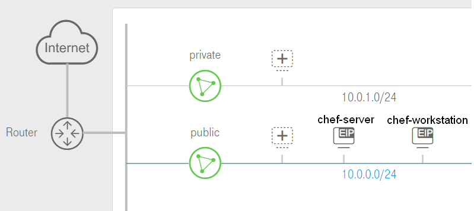
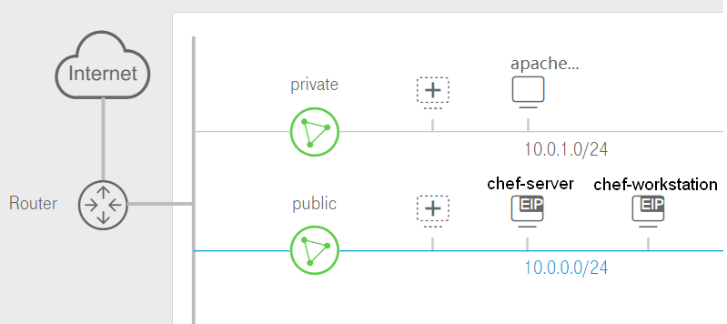
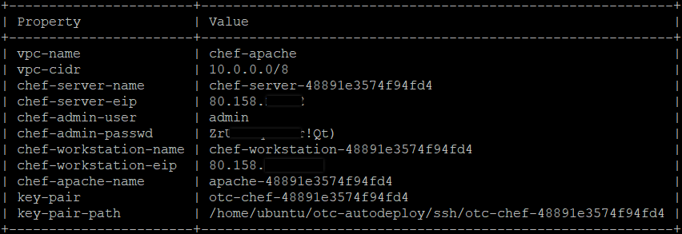
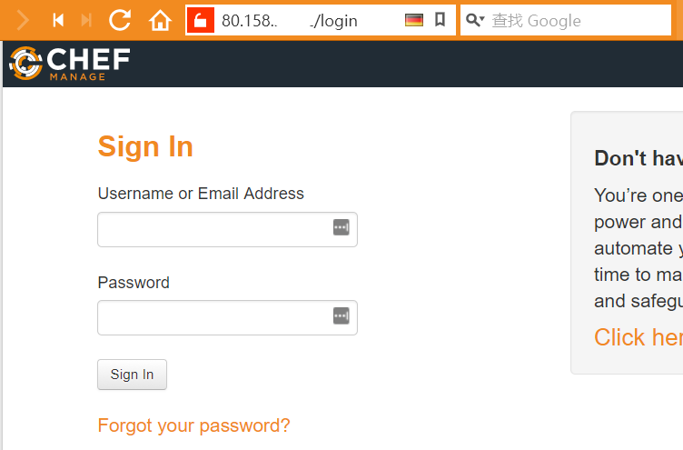
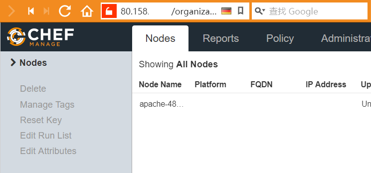
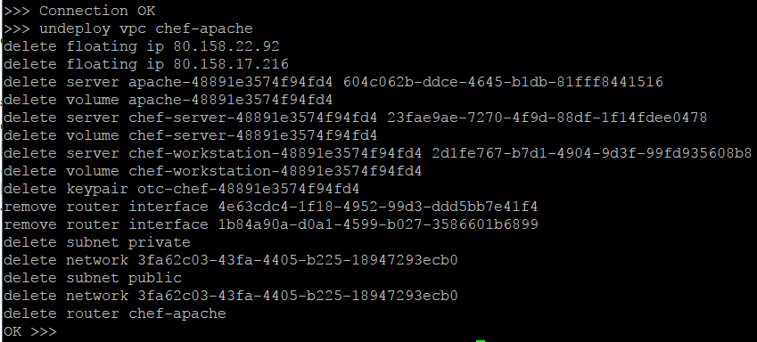

# Chef On OTC
---

## 1. Install auto-deploy tools
Git repositorie is:
`https://github.com/OpenTelekomCloud/otc-autodeploy.git`

Please follow the `README.md` to prepare your environment.

## 2. Set auto-deploy env
Create a new config file like:
```
[DEFAULT]
project_name = eu-de
project_id = 01234567890abcdefghijklmn
user = demo
user_domain = OTC00000000001000010001 
password = password

deploy=chef-apache
vpc_name=chef-apache
vpc_cidr=10.0.0.0/8
vpc_enable_snat=yes

[chef]
organization=otc

```
You can change the paramaters.

## 3. Deploy chef environment on OTC
You can `deploy` `chef-base` or `chef-apache`. 
`chef-base` topology:

`chef-apache` topology:


You can use this command to deploy:
`python autodeploy.py --config-file ./conf/my.conf`

When the execution completes, you can see:


You can get the server ip from the display info.
Open the server eip in web browser:


Use the `user-name` and `password` get from the display info to login.
You can find the apache node.


## 4. Undeploy
You can use this command to undeploy a vpc:
`python autodeploy.py --config-file ./conf/user.conf --undeploy vpc --vpc-name xxxx`
The `user.conf` file only contain the OTC user info.
After execution, you can see:
